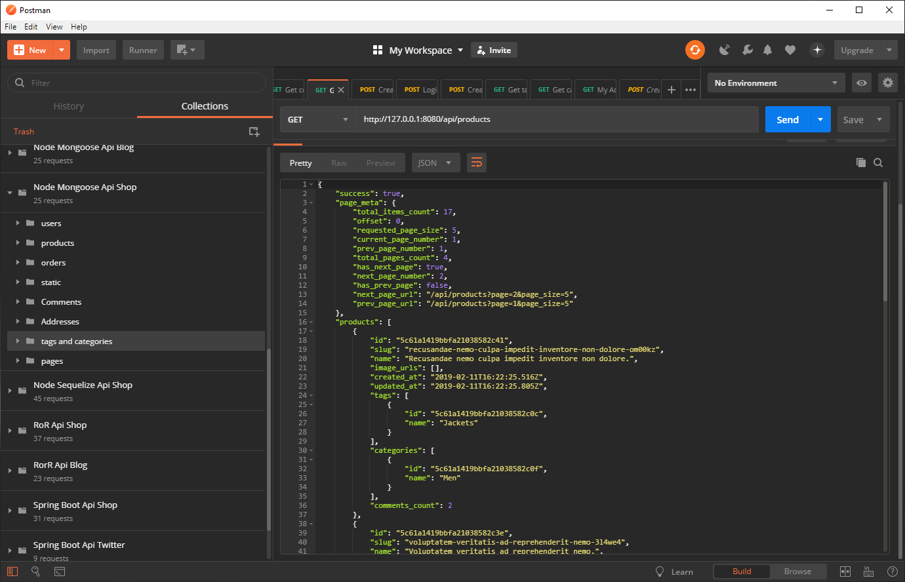
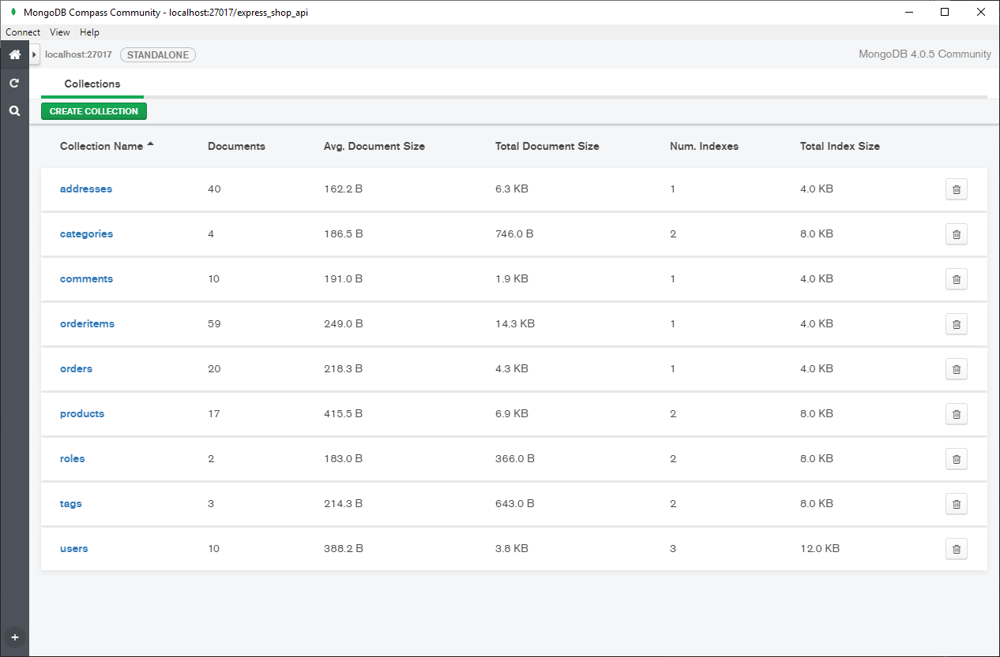

# ApiExpressMongoEcommerce
# Table of Contents
- [Introduction](#introduction)
- [Full-stack Applications](#full-stack-applications)
  * [E-commerce (shopping cart)](#e-commerce-shopping-cart)
    + [Server side implementations](#server-side-implementations)
    + [Client side implementations](#client-side-implementations)
  * [Blog/CMS](#blogcms)
    + [Server side implementations](#server-side-implementations-1)
    + [Client side](#client-side)
      - [The next come are](#the-next-come-are)
  * [Simple CRUD(Create, Read, Update, Delete)](#simple-crudcreate-read-update-delete)
    + [Server side implementations](#server-side-implementations-2)
    + [Client side implementations](#client-side-implementations-1)
      - [The next come are](#the-next-come-are-1)
  * [CRUD + Pagination](#crud--pagination)
    + [Server side implementations](#server-side-implementations-3)
      - [The next come are](#the-next-come-are-2)
    + [Client side implementations](#client-side-implementations-2)
      - [The next come are](#the-next-come-are-3)
- [Follow me](#social-media-links)
    
    
# Introduction
This is one of my E-commerce API app implementations. It is written in Node js, using Express and Mongoose as the main dependencies.
This is not a finished project by any means, but it has a valid enough shape to be git cloned and studied if you are interested in this topic.
If you are interested in this project take a look at my other server API implementations I have made with:

# Full-stack Applications
## E-commerce (shopping cart)
### Server side implementations
- [Spring Boot + Spring Data Hibernate](https://github.com/melardev/SBootApiEcomMVCHibernate)
- [Spring Boot + JAX-RS Jersey + Spring Data Hibernate](https://github.com/melardev/SpringBootEcommerceApiJersey)
- [Node Js + Sequelize](https://github.com/melardev/ApiEcomSequelizeExpress)
- [Node Js + Bookshelf](https://github.com/melardev/ApiEcomBookshelfExpress)
- [Node Js + Mongoose](https://github.com/melardev/ApiEcomMongooseExpress)
- [Python Django](https://github.com/melardev/DjangoRestShopApy)
- [Flask](https://github.com/melardev/FlaskApiEcommerce)
- [Golang go gonic](https://github.com/melardev/api_shop_gonic)
- [Ruby on Rails](https://github.com/melardev/RailsApiEcommerce)
- [AspNet Core](https://github.com/melardev/ApiAspCoreEcommerce)
- [Laravel](https://github.com/melardev/ApiEcommerceLaravel)

The next to come are:
- Spring Boot + Spring Data Hibernate + Kotlin
- Spring Boot + Jax-RS Jersey + Hibernate + Kotlin
- Spring Boot + mybatis
- Spring Boot + mybatis + Kotlin
- Asp.Net Web Api v2
- Elixir
- Golang + Beego
- Golang + Iris
- Golang + Echo
- Golang + Mux
- Golang + Revel
- Golang + Kit
- Flask + Flask-Restful
- AspNetCore + NHibernate
- AspNetCore + Dapper

### Client side implementations
This client side E-commerce application is also implemented using other client side technologies:
- [React Redux](https://github.com/melardev/ReactReduxEcommerceRestApi)
- [React](https://github.com/melardev/ReactEcommerceRestApi)
- [Vue](https://github.com/melardev/VueEcommerceRestApi)
- [Vue + Vuex](https://github.com/melardev/VueVuexEcommerceRestApi)
- [Angular](https://github.com/melardev/AngularEcommerceRestApi)

## Blog/CMS
### Server side implementations
- [Spring Boot + Spring Data Hibernate](https://github.com/melardev/SpringBootApiBlog)
- [Go + Gin Gonic](https://github.com/melardev/GoGonicBlogApi)
- [NodeJs + Mongoose](https://github.com/melardev/ApiBlogExpressMongoose)
- [Laravel](https://github.com/melardev/LaravelApiBlog)
- [Ruby on Rails + JBuilder](https://github.com/melardev/RailsApiBlog)
- [Django + Rest-Framework](https://github.com/melardev/DjangoApiBlog)
- [Asp.Net Core](https://github.com/melardev/AspCoreApiBlog)
- [Flask + Flask-SQLAlchemy](https://github.com/melardev/FlaskApiBlog)

The next to come are:
- Spring Boot + Spring Data Hibernate + Kotlin
- Spring Boot + Jax-RS Jersey + Hibernate + Kotlin
- Spring Boot + mybatis
- Spring Boot + mybatis + Kotlin
- Asp.Net Web Api v2
- Elixir
- Golang + Beego
- Golang + Iris
- Golang + Echo
- Golang + Mux
- Golang + Revel
- Golang + Kit
- Flask + Flask-Restful
- AspNetCore + NHibernate
- AspNetCore + Dapper

### Client side
- [Vue + Vuex](https://github.com/melardev/VueVuexBlog)
- [Vue](https://github.com/melardev/VueBlog)
- [React + Redux](https://github.com/melardev/ReactReduxBlog)
- [React](https://github.com/melardev/ReactBlog)
- [Angular](https://github.com/melardev/AngularBlog)

The next come are
- Angular NgRx-Store
- Angular + Material
- React + Material
- React + Redux + Material
- Vue + Material
- Vue + Vuex + Material
- Ember

## Simple CRUD(Create, Read, Update, Delete)
### Server side implementations
- [Spring Boot + Spring Data Hibernate](https://github.com/melardev/SpringBootApiJpaCrud)
- [Spring boot + Spring Data Reactive Mongo](https://github.com/melardev/SpringBootApiReactiveMongoCrud)
- [Spring Boot + Spring Data Hibernate + Jersey](https://github.com/melardev/SpringBootApiJerseySpringDataCrud)
- [NodeJs Express + Mongoose](https://github.com/melardev/ExpressMongooseApiCrud)
- [Nodejs Express + Bookshelf](https://github.com/melardev/ExpressBookshelfApiCrud)
- [Nodejs Express + Sequelize](https://github.com/melardev/ExpressSequelizeApiCrud)
- [Go + Gin-Gonic + Gorm](https://github.com/melardev/GoGinGonicApiGormCrud)
- [Ruby On Rails](https://github.com/melardev/RailsApiCrud)
- [Ruby On Rails + JBuilder](https://github.com/melardev/RailsApiJBuilderCrud)
- [Laravel](https://github.com/melardev/LaravelApiCrud)
- [AspNet Core](https://github.com/melardev/AspNetCoreApiCrud)
- [AspNet Web Api 2](https://github.com/melardev/AspNetWebApiCrud)
- [Python + Flask](https://github.com/melardev/FlaskApiCrud)
- [Python + Django](https://github.com/melardev/DjanogApiCrud)
- [Python + Django + Rest Framework](https://github.com/melardev/DjangoRestFrameworkCrud)

### Client side implementations
- [VueJs](https://github.com/melardev/VueAsyncCrud)

#### The next come are
- Angular NgRx-Store
- Angular + Material
- React + Material
- React + Redux + Material
- Vue + Material
- Vue + Vuex + Material
- Ember
- Vanilla javascript

## CRUD + Pagination
### Server side implementations
- [Spring Boot + Spring Data + Jersey](https://github.com/melardev/SpringBootJerseyApiPaginatedCrud)
- [Spring Boot + Spring Data](https://github.com/melardev/SpringBootApiJpaPaginatedCrud)
- [Spring Boot Reactive + Spring Data Reactive](https://github.com/melardev/ApiCrudReactiveMongo)
- [Go with Gin Gonic](https://github.com/melardev/GoGinGonicApiPaginatedCrud)
- [Laravel](https://github.com/melardev/LaravelApiPaginatedCrud)
- [Rails + JBuilder](https://github.com/melardev/RailsJBuilderApiPaginatedCrud)
- [Rails](https://github.com/melardev/RailsApiPaginatedCrud)
- [NodeJs Express + Sequelize](https://github.com/melardev/ExpressSequelizeApiPaginatedCrud)
- [NodeJs Express + Bookshelf](https://github.com/melardev/ExpressBookshelfApiPaginatedCrud)
- [NodeJs Express + Mongoose](https://github.com/melardev/ExpressApiMongoosePaginatedCrud)
- [Python Django](https://github.com/melardev/DjangoApiCrudPaginated)
- [Python Django + Rest Framework](https://github.com/melardev/DjangoRestFrameworkPaginatedCrud)
- [Python Flask](https://github.com/melardev/FlaskApiPaginatedCrud)
- [AspNet Core](https://github.com/melardev/AspNetCoreApiPaginatedCrud)
- [AspNet Web Api 2](https://github.com/melardev/WebApiPaginatedAsyncCrud)

#### The next come are
- NodeJs Express + Knex
- Flask + Flask-Restful
- Laravel + Fractal
- Laravel + ApiResources
- Go with Mux
- AspNet Web Api 2
- Jersey
- Elixir

### Client side implementations
- [Angular](https://github.com/melardev/AngularPaginatedAsyncCrud)
- [React-Redux](https://github.com/melardev/ReactReduxPaginatedAsyncCrud)
- [React](https://github.com/melardev/ReactAsyncPaginatedCrud)
- [Vue + Vuex](https://github.com/melardev/VueVuexPaginatedAsyncCrud)
- [Vue](https://github.com/melardev/VuePaginatedAsyncCrud)

#### The next come are
- Angular NgRx-Store
- Angular + Material
- React + Material
- React + Redux + Material
- Vue + Material
- Vue + Vuex + Material
- Ember
- Vanilla javascript

# Social media links
- [Youtube Channel](https://youtube.com/melardev) I publish videos mainly on programming
- [Blog](http://melardev.com) Sometimes I publish the source code there before Github
- [Twitter](https://twitter.com/@melardev) I share tips on programming

## WARNING
I have mass of projects to deal with so I make some copy/paste around, if something I say is missing or is wrong, then I apologize
and you may let me know opening an issue.

# Getting started
As with most node js projects, do the following
1. git clone the project
2. Rename the .env.example to .env and change the settings according to what you need, configure the mongodb url there
3. npm install
4. npm start
5. The last step is up to you, you can either open it in an IDE and debug it, or you can open the api.postman_collection.json with Postman, and then execute the queries

# Features
- Authentication / Authorization
- Paging
- CRUD operations on products, comments, tags, categories

- Orders, guest users may place an order

# What you will learn
- Mongoose ORM
    - associations: ref, ref[]
    - virtual attributes
    - complex queries
- express
    - middlewares
    - authentication
    - authorization
    
- seed data with faker js

- misc
    - project structure
    - dotenv

# Understanding the project
The project is meant to be educational, to learn something beyond the hello world thing we find in a lot, lot of 
tutorials and blog posts. Since its main goal is educational, I try to make as much use as features of APIs, in other
words, I used different code to do the same thing over and over, there is some repeated code but I tried to be as unique
as possible so you can learn different ways of achieving the same goal.

In most MongoDB applications the treatment of databases is completely different than Relation databases, in this app I 
did not follow that tendency, I treated MongoDB like it was a relation database, this is why I set bidirectional associations, for example:
usually people will store under roles collection an array of usernames that belong to that user, or another approach would be
to create an array of Ref to User collection in each of the roles document, in other words they will be applying association in only one side,
in my app I set up associations in both sides:
each role has an array of references to User ids that belong to that role, at the same time, each user has an array of references to Role ids
he belongs to. It may not be recommended in real world applications, but hey ... this is how I like it to be, sorry if you are disapointed.

Project structure:
- models: Mvc, it is our domain data.
- dtos: it contains our serializers, they will create the response to be sent as json. They also take care of validating the input(feature incomplete)
- controllers: well this is the mvC, our business logic.
- routes: they register routes to router middleware
- middleware: some useful middleware, mainly the authentication and authorization middleware.
- config: the database configurer as well as passport authentication strategies configurer.
- seeds: contains the file that seeds the database.
- .env the env file from where to populate the process.env node js environment variable
- public: contains the uploaded files.

# Steps followed to create build this project (incomplete)

- Generate the project with express-generator, so first install it globally
`$ npm install express-generator -g`
- then create the project with
`express myapp`
- install dependencies
`npm install`
- then write the code as I did -)

# TODO
- There are some input directly used when making mongodb queries, check if that leads to NoSQL injection
- Sanitization
- Better organization of dto files
- Bidirectional associations: when setting address's user field, set the user's addresses array
It is a little bit weird to handle the bidirectional, and in most applications I read they do not do that, but I prefer to.
